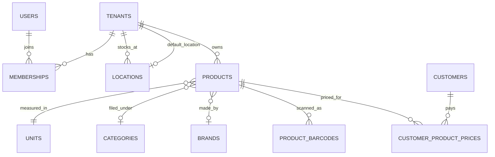
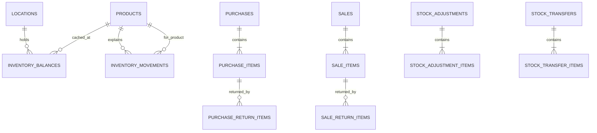
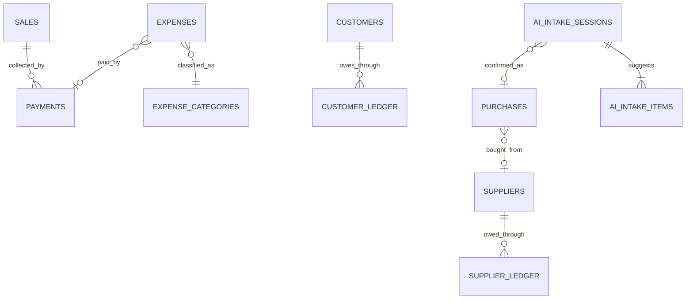

# DukaanOS database architecture

This is the database contract for DukaanOS. It is the source the application will post against. It does not contain shop workflows, HTTP handlers, or a profit job. Those come later and must obey the rules in this document.

PostgreSQL 18 is required. Primary keys default to `uuidv7()`. Money is `NUMERIC(18,2)`. Quantity is `NUMERIC(18,3)`. Event times are `timestamptz`. Reporting days are `business_date`.

## Database philosophy

A shopkeeper types very little. The database keeps the consequences traceable.

- A completed sale is one database transaction. Stock movements, the on-hand balance, payments, customer credit, and the bill either commit together or not at all.
- Inventory history is an append-only ledger. The balance row is a cache of that ledger, and a deferred check rejects a commit where they disagree.
- Money documents are not deleted. A mistake becomes a void, a return, or an adjustment.
- AI intake rows are drafts. They have no foreign key to stock tables. Stock changes only when a normal purchase or opening adjustment is posted.
- Every shop-owned row carries `tenant_id`. Child rows reference `(tenant_id, parent_id)`, so a bill in one shop cannot point at another shop's product.
- Row Level Security is the second wall. Application `WHERE tenant_id = ...` filters are not the isolation mechanism.

`daily_summaries`, `customers.receivable_balance`, `suppliers.payable_balance`, `products.average_cost`, and `inventory_balances` are caches. They can be rebuilt. The ledgers and posted document lines cannot.

## Entity list

Platform, no shop: `users`, `sessions`, `otp_challenges`.

Shop access: `tenants`, `memberships`, `devices`.

Catalog: `units`, `categories`, `brands`, `products`, `product_barcodes`, `product_price_history`, `customer_product_prices`.

Parties: `customers`, `suppliers`.

Stock: `locations`, `inventory_balances`, `inventory_movements`.

Documents: `purchases`, `purchase_items`, `purchase_returns`, `purchase_return_items`, `sales`, `sale_items`, `sale_returns`, `sale_return_items`, `stock_adjustments`, `stock_adjustment_items`, `stock_transfers`, `stock_transfer_items`.

Money: `payments`, `customer_ledger`, `supplier_ledger`, `expense_categories`, `expenses`, `daily_summaries`, `document_counters`.

Infrastructure: `audit_logs`, `idempotency_keys`, `outbox_events`, `ai_intake_sessions`, `ai_intake_items`.

Purchase returns and stock transfers are included because `PURCHASE_RETURN`, `TRANSFER_IN`, and `TRANSFER_OUT` movements need a document to point at. They are not a warehouse product. A transfer is one quantity moving between two locations of the same shop.

## Relationship map







Polymorphic links (`reference_type`, `reference_id`, `source_line_id`) are enforced by triggers rather than a single foreign key. A movement's `source_line_id` is the sale line, purchase line, return line, adjustment line, or transfer line that caused it. One line can have one movement of each type, which is how a sale and its void both point at the same line.

## Table-by-table explanation

### users

Platform identity. `phone` is required and globally unique. `email` is optional and unique. `password_hash` and `pin_hash` store hashes only. OTP codes are never stored on this table. This table has no `tenant_id` and no tenant RLS, because a person can belong to more than one shop and must exist before a shop is selected.

### sessions

Server-side session. `token_hash` is unique. The raw token is never stored. `revoked_at` ends the session without deleting the row. RLS shows a session only when `app.user_id` is the session's user.

### otp_challenges

One hashed code, a purpose, an expiry, and `attempt_count`. `consumed_at` marks use. There is no tenant RLS: the challenge is created before a session exists. Shop queries must not read this table.

### devices

A counter phone or tablet registered to one shop. `device_key` is unique inside the shop. `revoked_at` requires `is_active = false`.

### tenants

One independent business. Shop settings are columns here, not a JSON bag: `currency` (`INR`), `timezone` (`Asia/Kolkata`), `country` (`IN`), `business_type`, and `negative_stock_allowed` (`false`). `default_location_id` points at a location in the same shop through `(id, default_location_id) -> locations(tenant_id, id)`.

### memberships

Connects a user to one shop with one role. Unique on `(tenant_id, user_id)`.

### units

Shop-scoped, so a shop can add its own unit. Seeded set: Piece, Box, Kg, Gram, Liter, Meter. `decimal_places` is 0–3. A product has one unit. Pack conversions are not in this contract.

### categories

Optional parent, composite foreign key back to the same shop. Two roots cannot share a name. Two children under the same parent cannot share a name. Cycle prevention beyond `parent_id <> id` is an application rule.

### brands

Unique name per shop.

### products

The quick-add record. `name` is the display name in whichever language the owner confirmed. `name_en`, `name_hi`, and `name_mr` are optional search names. `sku` is optional and unique per shop when present. Category, brand, prices, and stock levels are optional. `unit_id` is required. `minimum_stock_level` is null when the owner has not asked to be warned. `average_cost` is a cache across locations, null when cost is unknown.

### product_barcodes

Many barcodes per product. Unique `(tenant_id, barcode)`. At most one `is_primary` barcode per product.

### product_price_history

Append-only catalog price changes for `PURCHASE` or `SELLING`. `old_price` is null the first time a price is set. Customer-specific prices are not written here. The price actually charged is stored on `sale_items`.

### customer_product_prices

One current row per shop, customer, and product. `valid_from` and `valid_until` can describe that single row. They do not allow a second overlapping row. Historical charged prices live on sale lines. Updating this row does not change old bills.

### customers

`opening_balance` is what the customer already owed when the shop started on DukaanOS. It must equal the net of `OPENING` ledger lines. `receivable_balance` is the cache of the full ledger. `phone` is unique per shop when present. `credit_limit` is optional and not enforced by a stock trigger.

### suppliers

Same shape for payables. `payable_balance` is the cache. A person who is both a customer and a supplier is two rows.

### locations

`Main Shop` is enough for the first shop. `(tenant_id)` is unique among rows with `is_default = true`. The screen hides location until a second one exists. The tables already support it.

### inventory_balances

One row per shop, product, and location. `quantity` must equal the sum of movements for that triple at commit. `average_cost` is the current weighted average at that location. Quantity cannot go below zero unless `tenants.negative_stock_allowed` is true. The product and location on a balance row cannot be changed.

### inventory_movements

Append-only. `quantity_delta` is signed and cannot be zero. `unit_cost` is the cost attached to that movement. `reference_type` and `reference_id` point at the document. `source_line_id` points at the document line. `business_date` is overwritten from `occurred_at` in the shop timezone.

Allowed signs:

| Movement | Sign |
|---|---|
| `OPENING_STOCK`, `PURCHASE`, `SALE_RETURN`, `SALE_VOID`, `TRANSFER_IN` | positive |
| `SALE`, `PURCHASE_RETURN`, `DAMAGE`, `EXPIRY`, `TRANSFER_OUT` | negative |
| `ADJUSTMENT` | either, except zero |

### purchases and purchase_items

A supplier bill. `bill_number` is unique per shop and should be allocated with `next_document_number`. `supplier_invoice_number` is the supplier's own number and is unique per supplier when both are present. Lines store `unit_cost` as it was on that bill.

`grand_total = subtotal - discount_total + tax_total`.

`sum(line_total) = subtotal - discount_total` when the purchase is confirmed. `line_total` is the line after discount and before tax.

Status `DRAFT` can be edited. Status `CONFIRMED` is frozen. Cancelling a confirmed purchase is rejected. Post a purchase return instead. Draft lines can be inserted only while the header is still `DRAFT`, so the posting transaction writes lines first and flips status last.

### purchase_returns and purchase_return_items

A confirmed return against a confirmed purchase. Quantity cannot exceed the original line minus earlier returns. `unit_cost` must equal the original purchase line. Status is constrained to `CONFIRMED`. The header is not deleted.

### sales and sale_items

There is no server-side draft sale. The open bill lives on the device until pay. `customer_id` is null for a walk-in. `payment_status` is the settlement snapshot (`UNPAID`, `PARTIAL`, `PAID`). What the customer still owes overall is the customer ledger, not this column, because later collections are not allocated to a single bill.

`unit_cost` is the cost snapshot used for profit. Null means the cost was unknown. Later changes to `products.average_cost` do not rewrite the line. The line is append-only.

`price_source` is `LIST`, `CUSTOMER`, or `MANUAL`.

`grand_total = subtotal - discount_total + tax_total + round_off`.

A completed sale must have lines, matching `SALE` movements, and payments plus credit that equal `grand_total`. A voided sale keeps those rows and adds `SALE_VOID` movements and reversing money rows. Sale identity fields and, after commit, the amounts cannot be edited. Same-day corrections inside the original transaction can still fix the header before commit.

### sale_returns and sale_return_items

Posted once, status `CONFIRMED`. A return line must belong to the original sale, match the product, keep `unit_cost`, and not exceed the unsold-back quantity. A voided sale cannot be returned. Undoing a return is a new document, not a delete. That limitation is recorded under ambiguities.

### stock_adjustments and stock_adjustment_items

`quantity_delta` is signed. Reason selects the movement type:

| Reason | Movement |
|---|---|
| `OPENING` | `OPENING_STOCK` (delta must be positive) |
| `DAMAGE` | `DAMAGE` |
| `EXPIRY` | `EXPIRY` |
| `CORRECTION`, `OTHER` | `ADJUSTMENT` |

Opening stock is an adjustment, not a fake supplier bill. Confirmed adjustments must have one matching movement per line.

### stock_transfers and stock_transfer_items

`quantity` is positive. A confirmed transfer requires `TRANSFER_OUT` at the source and `TRANSFER_IN` at the destination. The two locations must differ and belong to the same shop.

### payments

One table for money in and money out. `amount` is positive. Direction says which way it moved. Credit is not a method. The unpaid part of a bill is a ledger line, not a `CREDIT` tender.

`reference_id` is a real row in the same shop, checked by trigger, except standalone `CUSTOMER_RECEIPT` and `SUPPLIER_PAYMENT`, which store the party on the payment and are themselves the document a ledger line points at.

| reference_type | direction | reference_id | party |
|---|---|---|---|
| `SALE` | `IN` | sale | customer optional |
| `SALE_VOID` | `OUT` | sale | customer optional |
| `SALE_RETURN` | `OUT` | sale return | customer optional |
| `CUSTOMER_RECEIPT` | `IN` | null | customer required |
| `PURCHASE` | `OUT` | purchase | supplier optional |
| `PURCHASE_RETURN` | `IN` | purchase return | supplier optional |
| `SUPPLIER_PAYMENT` | `OUT` | null | supplier required |
| `EXPENSE` | `OUT` | expense | neither |

Payments are append-only. `business_date` comes from `payment_date` and the shop timezone.

### customer_ledger

Debit increases what the customer owes. Credit decreases it.

`receivable_balance = SUM(debit_amount - credit_amount)`.

`opening_balance = SUM(debit_amount - credit_amount)` of `OPENING` lines only.

A line is one-sided: either debit or credit, not both, and not zero. `running_balance` is an optional per-line cache the posting transaction may fill. The enforced cache is `customers.receivable_balance`.

| entry_type | effect | reference |
|---|---|---|
| `OPENING` | debit | `OPENING_BALANCE`, no id |
| `CREDIT_SALE` | debit of the unpaid portion only | `SALE` |
| `PAYMENT` | credit | `CUSTOMER_RECEIPT` pointing at the payment row |
| `SALE_RETURN` | credit | `SALE_RETURN` |
| `SALE_VOID` | credit that reverses the original debit | `SALE_VOID` |
| `ADJUSTMENT` | either side | `MANUAL_ADJUSTMENT`, no id |

A cash sale writes no customer ledger row. `paid + credit_sale debit = grand_total`. Credit requires `customer_id`.

### supplier_ledger

Credit increases what the shop owes. Debit decreases it.

`payable_balance = SUM(credit_amount - debit_amount)`.

| entry_type | effect | reference |
|---|---|---|
| `OPENING` | credit | `OPENING_BALANCE` |
| `PURCHASE` | credit of the unpaid portion | `PURCHASE` |
| `PAYMENT` | debit | `SUPPLIER_PAYMENT` pointing at the payment |
| `PURCHASE_RETURN` | debit | `PURCHASE_RETURN` |
| `ADJUSTMENT` | either side | `MANUAL_ADJUSTMENT` |

### expense_categories and expenses

Categories are copied into each shop. `is_system` marks the seeded set: Rent, Electricity, Salary, Transport, Internet, Maintenance, Packaging, Other. The shop can add more.

An expense has an amount, a category, and an optional payment. It does not create a sale or a stock movement. It reduces profit and, when a payment exists, reduces cash. It does not reduce revenue. The daily summary is not updated by a trigger. The reporting job writes that cache.

### daily_summaries

One row per shop per `business_date`. Every metric defaults to zero. Nothing in this contract recomputes the row. The posting service will upsert it inside the same transaction as the bill. A drift check can rebuild it.

Field meanings for that future job:

- `total_sales`: sum of `grand_total` for `COMPLETED` sales.
- `total_sales_returns`: sum of confirmed sale-return subtotals.
- `net_sales`: `total_sales - total_sales_returns`.
- `total_purchase`: sum of confirmed purchase `grand_total`. This is stock coming in, not an expense.
- `gross_profit`: sale-line revenue minus snapshotted cost, minus the same on returns, minus damage and expiry at `unit_cost`. Lines with null cost are excluded, not treated as zero cost.
- `total_expenses`: sum of expense amounts.
- `net_profit`: `gross_profit - total_expenses`.
- `cash_received`: `IN` payments referencing a sale.
- `credit_sales`: `CREDIT_SALE` debits.
- `customer_collections`: `IN` payments that are later customer receipts.
- `supplier_payments`: `OUT` payments for purchases and supplier payments.
- `closing_receivables` and `closing_payables`: ledger balances as of that business date, not the live cache copied blindly onto an old day.
- `products_sold`: quantities sold minus quantities returned.
- `transaction_count`: completed sales.
- `closed_at`: null while posting is still adding to the cache. A finalized closing sets it. Later sales, returns, expenses, and settlements do not change a finalized row until an explicit rebuild.

The application snapshot writes `gross_profit` as net sales minus sale-line cost plus the cost on returns. Damage and expiry are not subtracted yet, so the dashboard, the finance summary, and the closing stay on one formula.

### document_counters

Primary key `(tenant_id, document_type)`. `next_document_number(tenant, type)` locks the row with `SELECT … FOR UPDATE`, returns `prefix || lpad(next_number)`, then increments. Two transactions cannot receive the same number. The allocated text is stored on the document, where a unique key rejects duplicates if a caller bypasses the function. Missing counter raises `23514` rather than inventing one.

Seeded prefixes: `S-`, `P-`, `SR-`, `PR-`, `ADJ-`, `TR-`, width 5.

### audit_logs

Append-only. `action` and `entity_type` are text so a new action does not need an enum migration. `metadata` is JSONB and must not contain PINs, passwords, OTP codes, or session tokens. `tenant_id` is null only for platform maintenance rows. The app role cannot read those, because the policy requires a matching shop.

Vocabulary the application should use: `sale.created`, `sale.voided`, `purchase.confirmed`, `stock.adjusted`, `price.changed`, `customer.adjusted`, `supplier.adjusted`, `product.updated`, `membership.changed`.

### idempotency_keys

Unique `(tenant_id, key)`. The offline sale id is the key. A second insert fails with `23505`. The service treats that as a replay and returns `response_body` instead of posting again. The schema stores the response. It does not implement the replay.

### outbox_events

Written in the same transaction as the business change. `status` moves `PENDING → PROCESSING → PROCESSED`, or `FAILED`. Workers are not part of this contract. `event_type` is text (`sale.completed`, `intake.ready`).

### ai_intake_sessions and ai_intake_items

A camera upload creates a session (`IMAGE` or `VIDEO`) and suggested lines. Status moves `UPLOADED → PROCESSING → DRAFT_READY → CONFIRMED`, or `REJECTED` or `FAILED`. Items can be `PENDING`, `ACCEPTED`, or `REJECTED`. Names can be stored in English, Hindi, and Marathi. `matched_product_id` is a suggestion inside the same shop. `confirmed_purchase_id` is filled only after a normal purchase row exists. Setting the session to `CONFIRMED` by itself creates no movement and no balance. There is no foreign key from these tables to `inventory_movements` or `inventory_balances`.

The application stores upload metadata in `raw_output` and extra suggestion fields (SKU, unit, match type, shopkeeper edits) in `raw_suggestion`. Confidence is one score per item. There is no per-field confidence column. Media retention is not a database lifecycle. The API confirmation path creates a normal purchase or opening adjustment first, then sets `CONFIRMED` and, for a purchase, `confirmed_purchase_id`. A row updated to `CONFIRMED` without that business write still creates no stock.

## Important fields

| Concern | Where it lives |
|---|---|
| Display name | `products.name` |
| Hindi and Marathi search | `products.name_hi`, `products.name_mr`, `products.name_en` |
| Unknown cost | `products.average_cost` and `sale_items.unit_cost` left null |
| Cost used for an old bill | `sale_items.unit_cost` |
| Cost on a supplier bill | `purchase_items.unit_cost` |
| Current cost at a location | `inventory_balances.average_cost` |
| Why stock changed | `inventory_movements` |
| What the customer was charged | `sale_items.unit_selling_price`, `line_total`, `price_source` |
| What is still owed | `customer_ledger`, cached on `customers.receivable_balance` |
| Bill number | document column, allocated by `next_document_number` |
| Reporting day | `business_date` |
| Shop clock | `tenants.timezone` |

## Enum definitions

| Enum | Values | Why an enum |
|---|---|---|
| `business_type` | `GROCERY`, `ELECTRICAL`, `HARDWARE`, `MACHINERY`, `WHOLESALE`, `GENERAL` | Shop label only. It does not fork the schema. |
| `membership_role` | `OWNER`, `ADMIN`, `CASHIER`, `STOCK_KEEPER` | Fixed bundles. See ambiguities for why `STAFF` was not used. |
| `otp_purpose` | `LOGIN`, `INVITE`, `RECOVERY` | Closed set. |
| `price_type` | `PURCHASE`, `SELLING` | Catalog history. |
| `price_change_source` | `MANUAL`, `PURCHASE`, `IMPORT` | Who changed a catalog price. |
| `price_source` | `LIST`, `CUSTOMER`, `MANUAL` | Why this bill line used this price. |
| `movement_type` | `OPENING_STOCK`, `PURCHASE`, `SALE`, `SALE_RETURN`, `SALE_VOID`, `PURCHASE_RETURN`, `DAMAGE`, `EXPIRY`, `ADJUSTMENT`, `TRANSFER_IN`, `TRANSFER_OUT` | Signed stock reasons. |
| `sale_status` | `COMPLETED`, `VOIDED` | No draft sale on the server. |
| `payment_status` | `UNPAID`, `PARTIAL`, `PAID` | Snapshot on the bill. |
| `document_status` | `DRAFT`, `CONFIRMED`, `CANCELLED` | Purchases, adjustments, transfers. Returns are checked to `CONFIRMED` only. |
| `adjustment_reason` | `OPENING`, `DAMAGE`, `EXPIRY`, `CORRECTION`, `OTHER` | Maps to a movement type. |
| `payment_method` | `CASH`, `UPI`, `CARD`, `BANK_TRANSFER`, `OTHER` | How money moved. Not credit. |
| `payment_direction` | `IN`, `OUT` | Toward the shop or away. |
| `document_type` | `SALE`, `PURCHASE`, `SALE_RETURN`, `PURCHASE_RETURN`, `STOCK_ADJUSTMENT`, `STOCK_TRANSFER` | Counter sequences. |
| `reference_type` | document and payment references listed above | Polymorphic target. |
| `customer_ledger_entry_type` | `OPENING`, `CREDIT_SALE`, `PAYMENT`, `SALE_RETURN`, `SALE_VOID`, `ADJUSTMENT` | Receivable events. |
| `supplier_ledger_entry_type` | `OPENING`, `PURCHASE`, `PAYMENT`, `PURCHASE_RETURN`, `ADJUSTMENT` | Payable events. |
| `ai_intake_status` | `UPLOADED`, `PROCESSING`, `DRAFT_READY`, `CONFIRMED`, `REJECTED`, `FAILED` | Draft lifecycle. |
| `ai_item_status` | `PENDING`, `ACCEPTED`, `REJECTED` | Owner review of one suggestion. |
| `ai_source_type` | `IMAGE`, `VIDEO` | What was uploaded. |
| `outbox_status` | `PENDING`, `PROCESSING`, `PROCESSED`, `FAILED` | Delivery state. |

Not enums, on purpose: audit `action`, audit `entity_type`, outbox `event_type`, barcode type, and device `platform` (`android`, `ios`, `web`). New values there should not require a migration.

Role bundles, enforced later by the API, not by column privileges:

| | OWNER | ADMIN | CASHIER | STOCK_KEEPER |
|---|---|---|---|---|
| Sell and return | yes | yes | yes | no |
| See cost and profit | yes | yes | no | cost only |
| Products and purchases | yes | yes | name and selling price | yes |
| Stock adjustment | yes | yes | no | yes |
| Expenses and profit reports | yes | yes | no | no |
| Staff and shop settings | yes | no | no | no |

`ADMIN` is the blueprint's manager. RLS isolates shops. It does not hide cost from a cashier. The API serializer does that.

## Tenant isolation model

Every business table has `tenant_id`. Parents that children point at also have `UNIQUE (tenant_id, id)`. Children use foreign keys of the form `(tenant_id, parent_id) -> parent(tenant_id, id)`.

That covers products, units, categories, brands, barcodes, customers, suppliers, locations, documents, lines, ledgers, payments, expenses, and AI rows. `created_by` points at `users.id` because a user is not owned by one shop.

The client never chooses the shop. The session does. A body or query `tenant_id` is not authority.

Creating a shop: generate the tenant id, set `app.tenant_id` to that id, then insert. The insert policy requires `id = app_tenant_id()`.

## RLS model

Shop tables enable and force row level security. The policy is:

```sql
tenant_id = app_tenant_id()
```

`app_tenant_id()` reads `current_setting('app.tenant_id', true)`.

Special cases:

- `tenants`: the active shop, or any shop where `app.user_id` has a membership. Inserts still require the new id to be the active shop.
- `memberships`: visible for the active shop or for the current user, so the shop switcher can list memberships before a shop is selected. Inserts and updates require the active shop.
- `audit_logs`: shop rows only. Null-tenant platform rows are invisible to the app role.
- `sessions`: `user_id = app_user_id()`.
- `users` and `otp_challenges`: no tenant policy. They hold no shop ledger. Shop APIs must not list users globally or read `password_hash`, `pin_hash`, or `code_hash`.

The migration creates `dukaan_app` as `NOLOGIN`, `NOSUPERUSER`, `NOBYPASSRLS`. Superusers bypass RLS even when it is forced. The NestJS process must not connect as a superuser.

Production attaches a login to that role outside the migration, for example `ALTER ROLE dukaan_app LOGIN PASSWORD ...`, and uses it as `DATABASE_URL`. Tests call `SET LOCAL ROLE dukaan_app`.

### How a NestJS service sets the shop

Prisma's default is one transaction per query. `SET LOCAL` dies at the end of that query, and a session-level setting would leak across the pool. Every shop request uses one interactive transaction:

```ts
await prisma.$transaction(async (tx) => {
  await tx.$executeRaw`SELECT set_config('app.tenant_id', ${tenantId}::text, true)`;
  await tx.$executeRaw`SELECT set_config('app.user_id', ${userId}::text, true)`;
  // reads and writes for this request only
});
```

`true` means transaction-local. The tenant id comes from the verified membership on the server session, not from the request body. Login, before a shop is chosen, sets `app.user_id` only. Creating the first shop sets `app.tenant_id` to the id about to be inserted.

If the setting is missing, shop queries return no rows. Inserts fail.

## Inventory ledger model

```
on_hand(product, location) = SUM(quantity_delta)
```

The deferred constraint raises `23514` when `inventory_balances.quantity` disagrees. Deleting or updating a movement raises `23514`.

Weighted average is stored, not calculated by a trigger. The posting service, in the same transaction, will apply:

```
if old_qty <= 0 or old_average is null:
  new_average = receipt_unit_cost
else:
  new_average = (old_qty * old_average + received_qty * receipt_unit_cost)
                / (old_qty + received_qty)
```

Round half-up to 2 decimal places. Sales do not change the average. A customer return comes back at `sale_items.unit_cost` and is treated as a receipt at that cost. Damage and expiry remove quantity and do not change the average of what remains.

Fields that make this possible later:

- `inventory_balances.quantity`, `inventory_balances.average_cost`
- `inventory_movements.quantity_delta`, `inventory_movements.unit_cost`
- `purchase_items.unit_cost`
- `sale_items.unit_cost`
- `sale_return_items.unit_cost`
- `stock_adjustment_items.unit_cost`
- `products.average_cost` as the cross-location cache

Until that service exists, a manual SQL posting must write the average itself. The database will not invent it, and it will not silently change an old sale's cost.

## Sales model

One transaction, committed only if the deferred checks pass:

1. Set the shop context.
2. Allocate `next_document_number(tenant, 'SALE')` if the client did not already reserve one.
3. Insert the sale as `COMPLETED` with the final totals.
4. Insert sale lines, including `unit_cost` and `price_source`.
5. Insert one `SALE` movement per line with `quantity_delta = -quantity`.
6. Update the balance to the new movement sum.
7. Insert `IN` payments for money received. Insert a `CREDIT_SALE` debit for the unpaid portion and set `receivable_balance`.
8. Upsert `daily_summaries`, write `audit_logs`, write `outbox_events`, store the idempotency response.
9. Commit.

`business_date` on the sale, its movements, and its sale payments is derived from the event timestamp in `tenants.timezone`. A sale at 00:15 IST is the new Indian date even though UTC is still the previous evening. `shop_business_date(ts, tz)` is that conversion. Do not derive the day with `sale_date::date` in UTC.

Void, in a later transaction: set status to `VOIDED`, insert `SALE_VOID` movements for the same lines, refund the payments with `SALE_VOID` `OUT` payments, and credit the customer ledger for the original credit debit. Net stock and net money for that bill return to zero. The original rows stay.

## Purchase model

1. Insert the header as `DRAFT`.
2. Insert lines.
3. Insert `PURCHASE` movements and update balances and average cost.
4. Insert the `OUT` payment and/or the supplier `PURCHASE` credit.
5. Update status to `CONFIRMED`.
6. Commit.

A confirmed purchase with lines and no movements is rejected. A confirmed purchase whose payments plus payable do not equal `grand_total` is rejected. Credit requires `supplier_id`.

## Customer ledger

```
opening receivable + credit sales + debit adjustments
  - payments - sale returns - void credits - credit adjustments
  = receivable_balance
```

Debit means the customer owes more. Credit means the customer owes less. The cache and the `opening_balance` column are checked against the ledger at commit.

## Supplier ledger

```
opening payable + credit purchases + credit adjustments
  - supplier payments - purchase returns - debit adjustments
  = payable_balance
```

Credit means the shop owes more. Debit means the shop owes less.

## Payment model

Polymorphic `reference_type` + `reference_id` cannot be one foreign key. Integrity is a `BEFORE INSERT` trigger that looks up the target row in the same shop. The allowed shapes are the check constraint `payments_reference_shape`. Standalone receipts point the ledger at `payments.id`. The payment row itself has a null `reference_id` in that case, because it is the document.

`expenses.payment_id` is a real composite foreign key for the one payment that settled the expense. Insert the expense, insert the payment referencing it, then set `payment_id`. Payments cannot be updated, so the link is stored on the expense.

## Profit calculation model

For a sale line with a known cost:

```
line_revenue = line_total
line_cogs = quantity * unit_cost
line_gross_profit = line_revenue - line_cogs
```

`line_total` is after the line discount and before tax. Tax is not profit. Unknown `unit_cost` is excluded from profit and surfaced as missing cost. It is not treated as zero.

```
gross_profit = sale gross profit - return gross profit - damage and expiry cost
net_profit = gross_profit - expenses
```

Purchases and supplier payments are not subtracted from profit. They move cash out and stock in. Cash is a separate total: collections in, supplier payments out, expenses that have a payment.

`round_off` is its own signed amount so `grand_total` stays equal to the components. The header check is exact, not a float comparison.

## Daily summary model

`daily_summaries` is a cache keyed by `(tenant_id, business_date)`. The contract creates it and defines the metrics. It does not maintain it. An expense insert does not create a summary row. A reporting bug cannot be fixed by editing history. Recompute the row from documents.

## AI intake model

```
upload -> ai_intake_sessions (UPLOADED)
      -> provider fills ai_intake_items (DRAFT_READY)
      -> shopkeeper edits quantity and prices
      -> application posts a purchase, or an opening adjustment, through the existing services
      -> session status becomes CONFIRMED
      -> confirmed_purchase_id is set only when that write was a purchase
```

The last step is the normal purchase or opening-stock transaction. The provider does not write those tables. The AI tables do not participate in stock triggers. Tests assert that a `CONFIRMED` session with an accepted item, inserted directly, still leaves `inventory_movements` empty, and that no foreign key reaches the stock tables. This phase uses a mock provider. Video processing is not enabled. A real vision provider is not connected.

## Idempotency

Unique `(tenant_id, key)`. The service inserts the key at the start of the posting transaction. A unique violation means the sale already exists. Read `response_status` and `response_body` and return them. Do not catch the error and insert a second sale.

## Outbox

Insert the event in the posting transaction. A worker later sets `status`, `attempts`, and `processed_at`. Payload is JSONB. No worker ships with this schema.

## Index strategy

Tenant-leading indexes:

- Products: `(tenant_id, sku)` unique, `(tenant_id, is_active)`, `(tenant_id, name)`, `(tenant_id, category_id)`, `(tenant_id, brand_id)`.
- Barcodes: unique `(tenant_id, barcode)`.
- Customers and suppliers: `(tenant_id, name)`, partial unique `(tenant_id, phone) WHERE phone IS NOT NULL`.
- Balances: unique `(tenant_id, product_id, location_id)`, plus `(tenant_id, location_id)` and `(tenant_id, product_id)`.
- Movements: `(tenant_id, product_id, occurred_at)`, `(tenant_id, product_id, business_date)`, `(tenant_id, reference_type, reference_id)`.
- Sales: `(tenant_id, business_date)`, `(tenant_id, customer_id)`, unique `(tenant_id, bill_number)`, `(tenant_id, created_at)`.
- Purchases: `(tenant_id, business_date)`, `(tenant_id, supplier_id)`, unique `(tenant_id, bill_number)`.
- Ledgers: `(tenant_id, customer_id, business_date)` and `(tenant_id, supplier_id, business_date)`.
- Expenses: `(tenant_id, business_date)`, `(tenant_id, category_id)`.
- Audit: `(tenant_id, entity_type, entity_id)`, `(tenant_id, occurred_at)`.
- Outbox: `(status, available_at)`.

Search uses `pg_trgm` GIN indexes on product `name`, `name_en`, `name_hi`, `name_mr`, and on customer and supplier names. Prisma does not model these cleanly, so they live in the contracts migration as partial indexes. Barcode and SKU lookup stays a unique btree hit and should be tried before a trigram search.

A scanner query is: exact barcode in this shop, else exact SKU, else `ILIKE` or `%` similarity across the three name columns, limit 20.

## Constraints

Enforced in the database:

- Money and prices are non-negative where a negative value has no meaning. `round_off` may be negative. Receivable and payable caches may be negative if the shop owes the party.
- Quantities on bills and returns are `> 0`. Movement and adjustment deltas are `<> 0` with the sign rules above.
- Header identities: sale and purchase grand totals equal their components.
- Return quantity cannot exceed the original line. Return cost and product must match the original line.
- Confirmed documents must have matching movements, balanced payments, and matching line sums. Checked at commit, so row insert order inside the transaction does not matter.
- Negative on-hand is rejected unless the shop flag is on.
- Balance quantity matches the movement sum.
- Customer and supplier caches match their ledgers.
- Posted lines and ledgers are append-only. Document headers are not deleted.
- One default location, one primary barcode, one customer price row, one daily summary, one idempotency key, one balance row.
- AI confidence is between 0 and 1.

Not enforced, on purpose:

- The weighted-average formula. The service writes `average_cost`. The schema keeps the inputs and the snapshots.
- Per-invoice allocation of later collections. The customer has one balance.
- Category cycles deeper than a self-parent.
- A full GST identity. `tax_amount` defaults to 0 so a later tax line does not require a new money column.

## Migration strategy

Three migrations, in order:

1. `20260924010000_init` — enums, tables, primary keys, foreign keys, Prisma indexes. Generated from `prisma/schema.prisma`.
2. `20260924020000_contracts` — `updated_at` defaults, `pg_trgm`, checks, partial indexes, search indexes, business-date assignment, immutability, posting checks, `next_document_number`, RLS, `dukaan_app`, comments.
3. `20260924030000_daily_closing` — `daily_summaries.closed_at`, so a finalized day can be told apart from the running cache.

Apply with `npx prisma migrate deploy`. Do not hand-edit a database. A diff from the migration history to `schema.prisma` is empty. Partial indexes, triggers, and policies are inside the second migration, so they are part of that history.

`uuidv7()` requires PostgreSQL 18. Local Homebrew and `docker-compose.yml` both use 18. The compose port is `54329` so it does not collide with a Postgres already on `5432`.

## Seed strategy

`npx prisma db seed` loads development master data only:

- User `[DEV] Seed Owner`, phone `+910000000001`, email `dev-seed@dukaanos.local`.
- Shop `[DEV] Pankaj Kirana`, grocery, `Asia/Kolkata`, INR.
- Location `[DEV] Main Shop`.
- Units: Piece, Box, Kg, Gram, Liter, Meter.
- Expense categories: Rent, Electricity, Salary, Transport, Maintenance, Internet, Other.
- Document counters at `1`.

There are no products, customers, bills, or stock movements. The seed is idempotent. It runs as the migration role, which bypasses RLS. Shop traffic must use `dukaan_app`.

Payment methods are the `payment_method` enum, not seed rows.

## Database Invariants

- Every business record belongs to exactly one tenant.
- A product cannot belong to another tenant.
- A sale cannot reference another tenant's customer, product, or location.
- A purchase cannot reference another tenant's supplier or product.
- Inventory balance is unique per tenant, product, and location.
- On-hand quantity equals the sum of movement deltas for that product and location.
- Inventory movements are append-only.
- Historical sale cost is preserved on `sale_items.unit_cost`.
- Historical purchase cost is preserved on `purchase_items.unit_cost`.
- A later catalog price or customer price does not change an old sale line.
- Customer balance is the ledger. `receivable_balance` is a cache that must match it.
- Supplier balance is the ledger. `payable_balance` is a cache that must match it.
- Daily summaries are derived data and are not maintained by triggers.
- AI drafts cannot create inventory movements or balances.
- Idempotency keys are unique per shop and block a duplicate posting insert.
- Financial documents, ledgers, payments, and movement rows are not deleted.
- A completed sale's payments plus its credit debit equal `grand_total`.
- Credit requires a named customer. A walk-in bill cannot carry credit.
- `business_date` is the civil date of the event in the shop timezone.
- Bill numbers allocated through `next_document_number` are unique under a row lock.
- Negative stock is rejected unless that shop has turned the flag on.
- The database role used by the API does not bypass row level security.

## Ambiguities resolved

The blueprint and the schema task disagreed in a few places. The smaller rule that still satisfies both is what shipped.

- Roles. The task asked for at least `OWNER`, `ADMIN`, and `STAFF`. The blueprint needs a cashier who cannot see cost and a stock person who can. `STAFF` cannot express that. The enum is `OWNER`, `ADMIN`, `CASHIER`, `STOCK_KEEPER`. `ADMIN` is the blueprint's manager.
- Average cost. Both `products.average_cost` and `inventory_balances.average_cost` exist. The location row is authoritative. The product column is a cache across locations.
- Credit tender. The blueprint allowed a credit payment method. This schema's method list has no credit. Unpaid amount is a customer or supplier ledger line. Split tender is real payments plus one ledger debit.
- Purchase returns and transfers. The movement list includes them, and a movement must point at a document. The extra tables are only a header, lines, and two locations. There is no warehouse, bin, or pick-wave model.
- `SALE_VOID`. Voids are not returns. The movement type is reserved so a same-day void restores stock without pretending the goods came back as a customer return.
- Return cancellation. Returns are insert-only and must stay `CONFIRMED`. A mistaken return is corrected with a new sale or adjustment. A second reversal movement type was not added.
- Customer prices. One current row per customer and product. `valid_from` and `valid_until` describe that row. They do not store a price calendar. Old bills already store the charged price.
- `minimum_stock_level`. Nullable. Null means no low-stock warning. Zero would warn for every empty optional threshold.
- Units. The task puts `tenant_id` on units, so they are copied per shop rather than stored as global rows.
- `business_date`. Callers may send a placeholder. A before-insert trigger overwrites it from the event timestamp and `tenants.timezone`. Ledger `business_date` stays caller-supplied so an opening balance can sit on the day the owner chooses. Sale payments that belong to the bill must use the bill's timestamp so the derived dates match.
- `payment_status`. It is a snapshot. Later udhaar collections do not have to be allocated back to the original bill. The customer balance is the source of truth.
- Platform RLS. `users` and `otp_challenges` are outside tenant policies so signup and OTP can run before a shop context exists.

## Database test checklist

Automated in `tests/database-contract.test.ts`:

- Money columns are `numeric(18,2)`, quantities are `numeric(18,3)`, sale time is `timestamptz`, and no float columns exist.
- 18:45 UTC is business date 2026-09-24 in `Asia/Kolkata` and 2026-09-23 in UTC.
- RLS is enabled and forced on `products`.
- Shop A cannot read shop B's products, customers, or balances, and cannot insert shop B's sale.
- `SET LOCAL` shop context does not survive the next transaction.
- A sale line cannot reference another shop's product (`sale_items_product_fk`).
- Movement updates, sale deletes, and purchase deletes are rejected.
- A negative balance is rejected by default.
- A `SALE` movement cannot use a positive delta.
- A purchase increases stock, a sale decreases it, a return increases it, and damage decreases it, with the balance matching the movements.
- A confirmed purchase without a movement cannot commit.
- A credit purchase sets supplier payable. A credit sale sets customer receivable.
- A second customer price for the same product is rejected. Changing the current price and the catalog price leaves the old sale line unchanged.
- Sale `unit_cost` stays at the snapshotted cost after `products.average_cost` changes.
- Returning more than was sold is rejected.
- An expense creates neither a sale, nor a movement, nor a daily summary.
- An AI session marked `CONFIRMED` creates no movement and has no foreign key to stock.
- A repeated idempotency key is rejected.
- Two concurrent `next_document_number` calls return `S-00001` and `S-00002`.

Still belongs to the posting service, not this schema:

- The weighted-average formula itself. The columns and the sale snapshot are in place. No trigger recomputes average cost.
- Rebuilding `daily_summaries` and proving an expense reduced net profit on that row.
- Returning the stored idempotency response instead of posting a second sale. The unique key is what makes the duplicate insert fail.
- The owner-confirm path that turns an AI draft into a purchase. The purchase path is tested. The AI row is tested to do nothing to stock. Wiring them is application work.
- Cashier responses omitting cost. That is API serialization. RLS does not hide columns inside a shop.

Run the automated list with `npx tsx --test tests/database-contract.test.ts` after `npx prisma migrate deploy`.
